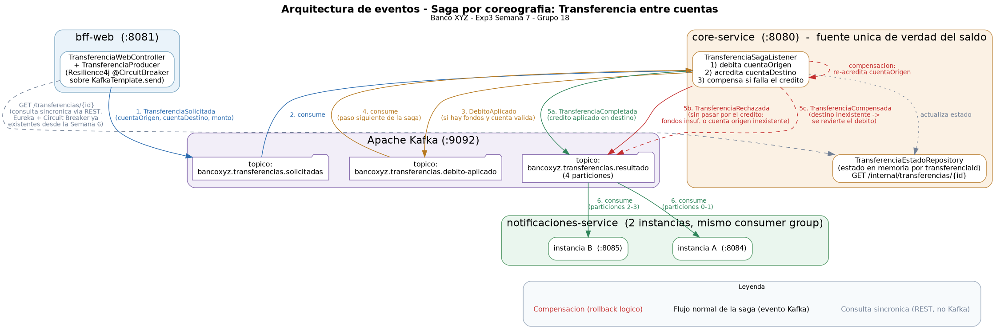
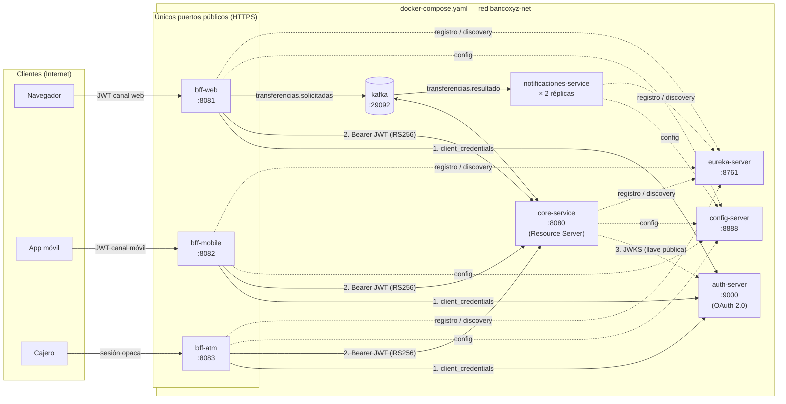
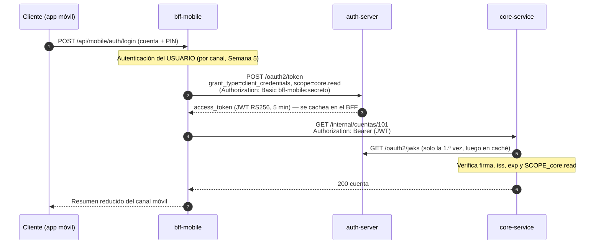

# Banco XYZ — Backend for Frontend (BFF) + Spring Cloud

**Curso:** Desarrollo Backend III (PBY2203) — Duoc UC

> **Estado actual (Exp3, Semana 8):** el ecosistema tiene **9 módulos**: `config-server`, `eureka-server`, `auth-server` (nuevo, OAuth 2.0), `core-service`, `bff-web`, `bff-mobile`, `bff-atm` y `notificaciones-service`, además del agregador Maven. Todos están **dockerizados** y se orquestan con **`docker-compose.yaml`** junto a Kafka. La comunicación BFF → `core-service` usa **OAuth 2.0** (`client_credentials` + JWT RS256), que reemplaza la antigua clave `X-Internal-Api-Key`. Para levantar todo: `mvn -DskipTests package && docker compose up -d --build --wait`. Ver la **[sección 13](#13-microservicios-seguros-y-resilientes-en-la-nube-oauth-20-docker-y-docker-compose-exp3-semana-8)**. Las secciones 1–12 documentan cada entrega anterior tal como fue evaluada.

## 1. Objetivo del proyecto

Implementar el patrón arquitectónico **Backend for Frontend (BFF)** para el sistema del Banco XYZ, creando un backend personalizado para cada tipo de cliente —**web**, **móvil** y **cajero automático**— que optimice la comunicación y adapte los datos a las necesidades reales de cada canal, en lugar de forzar a un único backend genérico a servir a los tres por igual. Esta actividad de la Semana 5 continúa el proyecto de la Semana 4 y agrega, como requisito nuevo, una configuración segura de cada BFF que incluye **HTTPS** con certificados.

Los datos provienen del mismo dataset legacy usado en la actividad Exp1 de este curso: [`bank_legacy_data`](https://github.com/KariVillagran/bank_legacy_data) (carpeta `data/semana_3`), reutilizando `intereses.csv` (maestro de cuentas) y `cuentas_anuales.csv` (historial de movimientos).

## 2. ¿Qué es el patrón BFF y por qué se eligió esta solución?

Un **patrón de diseño/arquitectónico** es una solución probada para un problema recurrente del desarrollo de software. El problema que resuelve **Backend for Frontend** es concreto: cuando varios tipos de cliente (un navegador de escritorio, una app móvil, un cajero automático) consumen el mismo backend, cada uno necesita datos distintos, en formatos distintos, con requisitos de seguridad distintos y con distinta tolerancia a la latencia y al peso de la respuesta. Un único backend "genérico" que intente satisfacer a los tres termina, con el tiempo, acumulando parámetros condicionales, ramas de código específicas por cliente y una superficie de autenticación mezclada — exactamente el escenario descrito en la guía de aprendizaje de esta semana ("Contexto de origen").

BFF resuelve esto invirtiendo el problema: en lugar de un backend que se adapta a todos, se construye **un backend dedicado por cada frontend**, que conoce exactamente las necesidades de su canal y expone solo lo que ese canal necesita. La transformación y optimización de datos ocurre en el BFF, no en el frontend ni en un backend centralizado que no puede permitirse esa especialización.

### 2.1 Análisis de la estrategia de implementación (instrucción específica N.º 1)

La guía de la semana describe tres estrategias no excluyentes para implementar BFF:

1. **Backends independientes por cada tipo de cliente**: un servicio desplegable por separado por canal, con su propio repositorio/ciclo de vida.
2. **Diseño de endpoints personalizados**: un mismo servicio, con rutas distintas por cliente (`/web/...`, `/mobile/...`).
3. **Aprovechar microservicios y delegar funciones al BFF**: el BFF como capa que combina y resume respuestas de microservicios existentes.

Para este proyecto se analizaron las tres a la luz de dos restricciones explícitas de las instrucciones específicas: *"Cada cliente deberá tener su propio Backend"* y *"Gestionar autenticación y autorización específicas para cada canal"*. La estrategia de **endpoints personalizados sobre un único servicio** queda descartada de inmediato: un solo proceso Spring Boot no puede tener "su propio backend" por canal en el sentido que piden las instrucciones, y mezclar tres esquemas de autenticación distintos (JWT de 30 minutos, JWT de 5 minutos, sesión opaca de 2 minutos) dentro de una misma aplicación habría recreado exactamente el backend monolítico y sobrecargado que el patrón BFF busca evitar.

Por eso, este proyecto adopta una **combinación deliberada de las estrategias 1 y 3**:

- **Estrategia 1 (backends independientes)** para satisfacer el requisito explícito: existen **cuatro aplicaciones Spring Boot completamente autónomas** —`core-service`, `bff-web`, `bff-mobile`, `bff-atm`—, cada una con su propio `pom.xml`, su propio `main()`, su propio puerto y su propio ciclo de vida. Ninguna depende de que las demás estén compiladas para arrancar.
- **Estrategia 3 (delegar en un backend generalizado)** para evitar el problema opuesto: si cada BFF leyera los CSV legacy y reimplementara su propia lógica de validación de datos, la lógica de negocio (qué es una cuenta válida, cómo se calcula el interés, etc.) quedaría triplicada y desincronizada. En su lugar, `core-service` consolida los datos legacy una sola vez y los expone mediante una API interna; los tres BFF son clientes de esa API, y cada uno decide **qué subconjunto de esos datos reenviar, en qué formato, y bajo qué reglas de autenticación**.

Esta combinación es, además, coherente con lo que la propia guía advierte: "el BFF puede funcionar sobre microservicios, gestionando datos específicos para cada frontend desde su propio backend dedicado". `core-service` cumple aquí el papel del "backend/microservicio" sobre el que operan los tres BFF.

## 3. Arquitectura general

```
                    ┌──────────────┐        ┌──────────────┐        ┌──────────────┐
                    │  Navegador   │        │   App Móvil  │        │Cajero Automát.│
                    │   (Web)      │        │              │        │    (ATM)      │
                    └──────┬───────┘        └──────┬───────┘        └──────┬───────┘
                           │ HTTPS/JSON            │ HTTPS/JSON            │ HTTPS/JSON
                           │ JWT 30 min            │ JWT 5 min             │ Sesión opaca 2 min
                     ┌─────▼──────┐          ┌─────▼──────┐          ┌─────▼──────┐
                     │  bff-web   │          │ bff-mobile │          │  bff-atm   │
                     │ :8081 (TLS)│          │ :8082 (TLS)│          │ :8083 (TLS)│
                     └─────┬──────┘          └─────┬──────┘          └─────┬──────┘
                           │                        │                       │
                           │ HTTP interno + X-Internal-Api-Key              │
                           │ (solo los BFF la conocen; sin TLS: tráfico     │
                           │  entre procesos internos, no expuesto)         │
                           └────────────────┬───────┴───────────────────────┘
                                            ▼
                                  ┌───────────────────┐
                                  │   core-service     │   ← backend generalizado,
                                  │   :8080 (HTTP)      │     NUNCA expuesto a un frontend
                                  │ (consolida legacy:  │
                                  │  intereses.csv +    │
                                  │  cuentas_anuales.csv)│
                                  └────────────────────┘
```

Ningún frontend llama jamás directamente a `core-service`. La única forma de acceder a sus datos es a través de uno de los tres BFF, cada uno de los cuales conoce la clave interna compartida (`X-Internal-Api-Key`) que `core-service` exige en toda petición. Esto materializa, a nivel de código, el principio central del patrón: **el backend generalizado no sabe ni le importa qué frontend existe**; son los BFF quienes conocen a sus clientes.

Con la incorporación de HTTPS en esta actividad, el diagrama distingue explícitamente dos tramos de comunicación con requisitos de seguridad distintos:

- **Cliente ↔ BFF (`bff-web`, `bff-mobile`, `bff-atm`):** ahora viaja sobre **HTTPS/TLS**, porque es el tramo expuesto — el que efectivamente cruza una red que un atacante podría interceptar (navegador, app móvil, red del cajero).
- **BFF ↔ `core-service`:** se mantiene sobre **HTTP plano**, deliberadamente. `core-service` nunca se expone a ningún frontend; solo lo consumen los tres BFF, en el mismo entorno de ejecución, autenticados con `X-Internal-Api-Key`. Los detalles de esta decisión y su justificación académica se documentan en la sección 5.1 y se listan también en la sección 9 junto con el resto de las simplificaciones del proyecto.

## 4. Personalización de la información por canal (evidencia del criterio "Personaliza la información según las necesidades de cada frontend")

Los tres BFF consultan exactamente la misma fuente de verdad (`core-service`) pero devuelven respuestas radicalmente distintas para la misma cuenta:

| | **BFF Web** (`GET /api/web/cuentas/101`) | **BFF Móvil** (`GET /api/mobile/cuentas/101/resumen`) | **BFF Cajero** (`GET /api/atm/cuentas/101/saldo`) |
| --- | --- | --- | --- |
| Nombre del titular | Sí | No | No |
| Edad del titular | Sí | No | No |
| Saldo | Sí | Sí | Sí (único dato, además del propio endpoint) |
| Tasa de interés e interés proyectado | Sí | No | No |
| Totales agregados (depósitos, retiros, compras) | Sí | No | No |
| Historial de movimientos | Completo, filtrable por tipo/fecha | Solo los últimos 3 | Ninguno |
| Operaciones permitidas | Solo lectura | Solo lectura | Lectura de saldo **y retiro de efectivo** |
| Tamaño aproximado de la respuesta | El mayor de los tres (pensado para tablas y gráficos de escritorio) | Reducido a propósito (ahorra ancho de banda móvil) | El más pequeño posible (pantalla de cajero, mínima exposición de datos personales) |

Esta tabla no es una descripción de intenciones: es literalmente el comportamiento de `CuentaWebResponse`, `CuentaMobileResumenResponse` y `SaldoResponse` (ver sección 6). Cada clase documenta, en su propio javadoc, por qué omite o incluye cada campo.

## 5. Autenticación y autorización específicas por canal

| Canal | Credencial | Mecanismo | Duración de sesión | Razonamiento |
| --- | --- | --- | --- | --- |
| **Web** | N.º de cuenta + nombre del titular | JWT firmado (HS256), claim con nombre | 30 minutos | Un usuario de escritorio puede dejar la sesión abierta mientras revisa varias pantallas; el riesgo de robo del dispositivo es menor que en un teléfono. |
| **Móvil** | N.º de cuenta + PIN de 4 dígitos | JWT firmado (HS256), sin nombre en el claim | 5 minutos | Un teléfono se pierde/roba con más frecuencia; se fuerza a renovar el token seguido. Un PIN es la credencial habitual de una app bancaria móvil. |
| **Cajero** | N.º de tarjeta + PIN (dos factores) | Token de sesión **opaco**, guardado en el servidor, invalidado automáticamente tras un retiro exitoso | 2 minutos, y de un solo uso para operaciones críticas | Es la operación de más riesgo (dinero en efectivo, en un espacio público); un token opaco permite revocación inmediata del lado del servidor, algo que un JWT autocontenido no ofrece sin infraestructura adicional (lista de revocación). |

> **Nota importante sobre las credenciales:** el dataset legacy del Banco XYZ no incluye contraseñas, PIN ni números de tarjeta reales. Para poder demostrar un flujo de autenticación end-to-end verificable, este proyecto genera credenciales **sintéticas y deterministas** a partir del `cuentaId` (ver `PinGenerator` y `TarjetaGenerator`), documentado explícitamente en el código como una simplificación académica. En un sistema real, estas credenciales se almacenarían hasheadas en un servicio de identidad dedicado, nunca derivadas matemáticamente.

### 5.1 Seguridad de transporte (HTTPS)

Como continuación de la actividad de la Semana 4, esta entrega agrega **HTTPS** a la configuración de seguridad de los tres BFF (`bff-web`, `bff-mobile`, `bff-atm`), de modo que el tramo de red efectivamente expuesto a un cliente externo —navegador, app móvil o cajero— viaje cifrado.

**Certificados.** Cada BFF tiene su propio keystore **PKCS12 autofirmado**, generado con `keytool` y empaquetado dentro del propio módulo (`src/main/resources/`), no en un almacén externo:

| Módulo | Archivo de keystore | Alias |
| --- | --- | --- |
| `bff-web` | `bff-web-keystore.p12` | `bffweb` |
| `bff-mobile` | `bff-mobile-keystore.p12` | `bffmobile` |
| `bff-atm` | `bff-atm-keystore.p12` | `bffatm` |

Comando usado para generar cada uno (ejemplo con `bff-web`):

```bash
keytool -genkeypair -alias bffweb -keyalg RSA -keysize 2048 -validity 825 \
  -storetype PKCS12 -keystore bff-web-keystore.p12 \
  -dname "CN=localhost, OU=BancoXYZ, O=DuocUC, L=Santiago, ST=RM, C=CL"
```

Y la configuración correspondiente agregada en el `application.yml` de cada módulo:

```yaml
server:
  ssl:
    enabled: true
    key-store: classpath:bff-web-keystore.p12
    key-store-type: PKCS12
    key-store-password: "keystore-canal-web-banco-xyz-no-usar-en-produccion-2026"
    key-alias: bffweb
```

(`bff-mobile` y `bff-atm` siguen el mismo esquema, cambiando el nombre de archivo, el alias y la contraseña por su canal correspondiente: `...-canal-movil-...` y `...-canal-atm-...`.)

**Por qué `core-service` queda deliberadamente fuera del alcance de TLS.** `core-service` sigue sirviendo en **HTTP plano** por el puerto 8080. Esto no es un descuido: como se explica en la sección 3, `core-service` **nunca se expone a ningún frontend**; sus únicos clientes son los tres BFF, que lo consumen internamente y se autentican con el header `X-Internal-Api-Key`. Cifrar ese tramo interno habría exigido gestionar un cuarto keystore y un cliente HTTP TLS en cada BFF solo para proteger tráfico que, en este proyecto académico, corre en el mismo entorno de ejecución y nunca cruza una red no confiable. Esta decisión se documenta también junto con el resto de las simplificaciones académicas del proyecto (sección 9).

**Cómo probar cada BFF con HTTPS.**

- Con `curl`, usando `-k` (o `--insecure`) porque el certificado es autofirmado y no fue emitido por una CA reconocida por el sistema:

  ```bash
  curl -k https://localhost:8081/api/web/auth/login -X POST -H "Content-Type: application/json" -d '{"cuentaId": 101, "nombre": "John Doe"}'
  curl -k https://localhost:8082/api/mobile/auth/login -X POST -H "Content-Type: application/json" -d '{"cuentaId": 101, "pin": "7373"}'
  curl -k https://localhost:8083/api/atm/sesion -X POST -H "Content-Type: application/json" -d '{"numeroTarjeta": "4915000000000101", "pin": "7373"}'
  ```

- Desde un navegador, al visitar `https://localhost:808x/...` este mostrará una advertencia de certificado no confiable (esperable con un certificado autofirmado); se debe agregar manualmente una excepción de seguridad para el certificado y continuar.

**Advertencia de producción.** Tanto el uso de un certificado autofirmado como el hecho de que las contraseñas de los keystores estén en texto plano dentro de `application.yml` son simplificaciones deliberadas para este entorno académico. En un sistema real de producción, el certificado sería emitido por una **CA (autoridad certificadora) reconocida** —pública (Let's Encrypt, DigiCert, etc.) o interna de la organización— y las contraseñas de los keystores, al igual que los secretos JWT ya usados en el proyecto, vivirían en un **gestor de secretos** (Vault, AWS Secrets Manager, Azure Key Vault, etc.), nunca en un archivo de configuración versionado en el repositorio.

## 6. Organización del código (evidencia del criterio "Organiza su código según la estrategia de implementación elegida")

La estructura de carpetas refleja directamente la estrategia elegida en la sección 2.1: **cuatro proyectos Maven independientes**, agregados solo por comodidad de build bajo un `pom.xml` raíz (`packaging=pom`), pero deployables por separado:

```text
banco-xyz-bff/
├── pom.xml                        (agregador, NO es el padre de Spring Boot de los módulos)
├── core-service/                  (backend generalizado — NUNCA expuesto a un frontend, HTTP plano)
│   └── src/main/java/com/bancoxyz/bff/core/
│       ├── model/                 Cuenta, Movimiento (dominio)
│       ├── repository/            CuentaRepository (repositorio en memoria)
│       ├── service/               CargaDatosService (carga y valida los CSV al iniciar)
│       ├── util/                  FechaFlexibleParser
│       ├── config/                InternalApiKeyFilter (exige X-Internal-Api-Key)
│       ├── controller/            CuentaInternalController (API interna, sin personalizar)
│       ├── dto/                   CuentaInternalDTO, MovimientoDTO, ActualizarSaldoRequest
│       └── exception/             manejo centralizado de errores
├── bff-web/                       (canal navegador — datos completos, HTTPS)
│   └── src/main/java/com/bancoxyz/bff/web/
│       ├── client/                CoreServiceClient + DTOs espejo de core-service
│       ├── security/              JwtService (30 min), JwtAuthFilter
│       ├── controller/            AuthController, CuentaWebController
│       ├── dto/                   CuentaWebResponse (respuesta rica y agregada)
│       └── exception/
│   └── src/main/resources/        application.yml (server.ssl) + bff-web-keystore.p12
├── bff-mobile/                    (canal app móvil — datos esenciales, HTTPS)
│   └── src/main/java/com/bancoxyz/bff/mobile/     (misma organización interna que bff-web)
│       ├── security/              JwtService (5 min), PinGenerator
│       └── dto/                   CuentaMobileResumenResponse (respuesta reducida)
│   └── src/main/resources/        application.yml (server.ssl) + bff-mobile-keystore.p12
├── bff-atm/                       (canal cajero — operaciones críticas, HTTPS)
│   └── src/main/java/com/bancoxyz/bff/atm/        (misma organización interna)
│       ├── security/              SesionAtmService (token opaco), TarjetaGenerator, PinGenerator
│       ├── controller/            SesionController, CuentaAtmController (saldo + retiro)
│       └── dto/                   SaldoResponse (la respuesta más reducida del proyecto)
│   └── src/main/resources/        application.yml (server.ssl) + bff-atm-keystore.p12
├── scripts/probar_apis.sh         Prueba end-to-end de los 4 servicios (HTTPS + curl -k para los BFF, HTTP para core-service)
└── .github/workflows/evidencia-ejecucion.yml   Evidencia de ejecución real (ver sección 8)
```

Cada módulo repite deliberadamente el mismo esqueleto interno (`client/`, `security/`, `controller/`, `dto/`, `exception/`): esto no es duplicación accidental, es la consecuencia directa de la estrategia elegida — si `bff-mobile` tuviera una estructura completamente distinta a `bff-web`, sería una señal de que en realidad no se está tratando a cada canal como un backend independiente y autónomo, sino como variaciones ad-hoc de un mismo código base.

### 6.1 Por qué no se comparte código (un `common`) entre los tres BFF

Cada BFF define su propia copia de `CoreServiceProperties`, sus propios DTOs espejo (`CuentaCoreDTO`, `MovimientoCoreDTO`) y, en el caso de `bff-mobile`/`bff-atm`, su propia copia de `PinGenerator`. Esto es intencional: la estrategia de "backends independientes" busca que cada BFF pueda evolucionar, desplegarse y versionarse sin coordinar cambios con los demás. Introducir una librería compartida recrearía un acoplamiento oculto entre los tres canales — si un cambio en esa librería obligara a recompilar y redesplegar los tres BFF a la vez, ya no serían realmente independientes. El único acoplamiento real y deliberado del proyecto es el contrato HTTP/JSON de `core-service`, documentado y estable. Esta misma independencia se refleja ahora también en la configuración de HTTPS: cada BFF tiene su propio keystore, su propio alias y su propia contraseña, sin un almacén de certificados compartido entre los tres.

## 7. Cómo ejecutar el proyecto

> Desde la Semana 8, la forma recomendada de ejecutar el proyecto completo es con Docker Compose (sección 13.4). Las instrucciones `java -jar` de esta sección siguen siendo válidas: ahora hay que levantar también `auth-server` (`:9000`) después de `eureka-server` (ver `scripts/generar_evidencia.sh`).

### 7.1 Requisitos

- JDK 21
- Maven 3.9+ (o el wrapper, si se agrega)
- Un puerto libre 8080–8083

### 7.2 Compilar y ejecutar localmente

```bash
# Desde la raíz del proyecto, compila los 6 módulos:
mvn -DskipTests package

# En 6 terminales distintas (el orden importa, ver sección 11.2 para el detalle):
java -jar config-server/target/config-server.jar
java -jar eureka-server/target/eureka-server.jar
java -jar core-service/target/core-service.jar
java -jar bff-web/target/bff-web.jar
java -jar bff-mobile/target/bff-mobile.jar
java -jar bff-atm/target/bff-atm.jar

# En una séptima terminal, una vez los 6 procesos estén arriba:
bash scripts/probar_apis.sh
```

Con HTTPS ya configurado, los tres BFF quedan disponibles en:

- `https://localhost:8081` (`bff-web`)
- `https://localhost:8082` (`bff-mobile`)
- `https://localhost:8083` (`bff-atm`)

mientras que `core-service` se mantiene en `http://localhost:8080` (tráfico interno, ver sección 5.1). El script `scripts/probar_apis.sh` ya refleja esto: llama a los tres BFF por `https://` (con `curl -k`, dado el certificado autofirmado) y a `core-service` por `http://`.

### 7.3 Credenciales de demostración

Calculadas a partir del dataset real (`intereses.csv`, semana 3) tras la validación y el upsert que aplica `CargaDatosService` (idéntico criterio, documentado y verificado con evidencia real, al usado en el proyecto Exp1 de este curso):

| cuentaId | Titular | Tipo | Saldo | PIN (móvil/cajero) | N.º de tarjeta (cajero) |
| --- | --- | --- | --- | --- | --- |
| 101 | John Doe | préstamo | 10.000 | 7373 | 4915000000000101 |
| 105 | Steve Rogers | ahorro | 10.000 | 7665 | 4915000000000105 |
| 108 | Diana Prince | ahorro | 10.000 | 7884 | 4915000000000108 |
| 118 | Jane Smith | ahorro | 12.000 | 8614 | 4915000000000118 |

(Login web: `{"cuentaId": <id>, "nombre": "<Titular>"}`. Login móvil: `{"cuentaId": <id>, "pin": "<PIN>"}`. Sesión de cajero: `{"numeroTarjeta": "<tarjeta>", "pin": "<PIN>"}`.)

## 8. Evidencia de ejecución

La evidencia de ejecución real se genera con **GitHub Actions** (`.github/workflows/evidencia-ejecucion.yml`). El workflow:

1. Compila los 4 módulos con Maven.
2. Levanta `core-service`, `bff-web`, `bff-mobile` y `bff-atm` como procesos reales, en ese orden, esperando activamente a que cada uno responda antes de continuar (los tres BFF ya arrancan con HTTPS habilitado).
3. Ejecuta `scripts/probar_apis.sh` contra los 4 servicios reales corriendo en el runner de GitHub.
4. Publica los logs de arranque de cada servicio y la salida completa de las pruebas como un artefacto descargable (`evidencias-ejecucion-bff`) en la pestaña **Actions** del repositorio, en la sección **Artifacts** del run correspondiente.

El script de pruebas (sección 7.2) ejercita, con datos reales, los cuatro flujos completos: rechazo de acceso directo a `core-service`, login y consulta completa en el canal web (incluyendo la verificación de que un token no puede acceder a la cuenta de otra persona), login y resumen reducido en el canal móvil, y el flujo completo de cajero (apertura de sesión, consulta de saldo, retiro exitoso, invalidación automática de la sesión tras el retiro, y rechazo de un retiro que excede el límite máximo por operación).

### 8.1 Evidencia de ejecución previa (03-09-2026) — corresponde a la versión sin HTTPS

El workflow se ejecutó exitosamente en GitHub Actions, con los 4 módulos compilando sin errores (`BUILD SUCCESS`) y los 4 servicios arrancando correctamente sobre datos legacy reales (`core-service` cargó 49 cuentas y 885 movimientos válidos desde los CSV). El script de pruebas (`evidencia06-pruebas-apis.log`) confirmó, contra las APIs reales corriendo en el runner, todos los comportamientos esperados:

- `core-service` rechaza (HTTP 403) cualquier llamada sin el header `X-Internal-Api-Key`, y responde con el dominio completo cuando la clave es correcta — el backend generalizado nunca queda expuesto directamente a un frontend.
- **BFF Web**: login exitoso, consulta de cuenta completa con agregados (tasa de interés, interés proyectado, totales por tipo de movimiento) e historial filtrable por tipo de movimiento; un token válido de la cuenta 101 recibe HTTP 403 al intentar consultar la cuenta 105 (autorización por titularidad funcionando).
- **BFF Móvil**: login con PIN determinista y respuesta deliberadamente reducida (saldo, tipo de cuenta y solo los últimos 3 movimientos, sin nombre ni edad del titular), evidenciando la personalización por canal frente al payload completo del canal Web.
- **BFF Cajero**: apertura de sesión con tarjeta + PIN, consulta de saldo mínima (sin historial ni datos personales), retiro de $1.000 exitoso, invalidación automática de la sesión inmediatamente después del retiro (HTTP 401 al reutilizarla) y rechazo correcto de un retiro que excede el límite máximo por operación.

Los 6 archivos de log generados por este run (`evidencia01-build.log` a `evidencia06-pruebas-apis.log`) quedan como artefacto descargable del run correspondiente en la pestaña Actions del repositorio.

> **Nota:** esta corrida del 03-09-2026 corresponde a la versión del proyecto **previa a la incorporación de HTTPS** (los tres BFF respondían aún en `http://`) y se conserva aquí solo como referencia histórica del comportamiento funcional de los 4 flujos. El pipeline **ya fue re-ejecutado** después de agregar los keystores y la configuración TLS: la corrida vigente, con los tres BFF respondiendo efectivamente sobre `https://`, es la que se documenta en la sección 11.7 (evidencia actual, generada junto con la actividad de Semana 6), donde `evidencia03-bff-web.log`, `evidencia04-bff-mobile.log` y `evidencia05-bff-atm.log` confirman TLS activo con el keystore y alias correctos de cada servicio.

## 9. Decisiones de diseño y simplificaciones (transparencia académica)

- **Persistencia en memoria, no una base de datos real.** El foco de esta actividad es el patrón BFF, no la capa de persistencia. `core-service` carga los CSV legacy en un repositorio en memoria al iniciar. Podría reemplazarse por PostgreSQL/JPA (como en el proyecto Exp1) sin que ningún BFF se entere: el contrato que consumen es la API HTTP de `core-service`, nunca su almacenamiento interno.
- **Consolidación de dos fuentes legacy en un solo dominio.** `intereses.csv` (maestro de cuentas) y `cuentas_anuales.csv` (historial de movimientos) eran, en el proyecto Exp1, dos procesos batch independientes sin relación directa entre sí. Para esta actividad se unifican bajo un mismo `cuentaId`, tal como exigiría un ejercicio real de modernización que consolida silos de datos legacy dispersos en un modelo de dominio único y consultable.
- **Credenciales sintéticas y deterministas**, ya documentadas en la sección 5, necesarias porque el dataset legacy no incluye contraseñas, PIN ni números de tarjeta.
- **Límite de reintentos/validación de datos al cargar CSV**: se reutiliza el mismo criterio de validación (tipo de cuenta soportado, edad 18–90, saldo no negativo, nombre no vacío/"Unknown") ya verificado con evidencia real en el proyecto Exp1, para no introducir criterios de calidad de datos nuevos y no probados.
- **HTTPS con certificado autofirmado, no emitido por una CA real**, y contraseñas de keystore en `application.yml` en texto plano (mismo patrón "no usar en producción" que ya seguían los secretos JWT del proyecto). Suficiente para demostrar el mecanismo de configuración de TLS en Spring Boot en un entorno académico local; en producción correspondería un certificado de una CA reconocida y las contraseñas en un gestor de secretos (ver sección 5.1).
- **`core-service` queda fuera del alcance de TLS**, deliberadamente: nunca se expone a un frontend, solo lo consumen los tres BFF internamente vía `X-Internal-Api-Key` (ver sección 5.1). Cifrar ese tramo interno no aportaba valor demostrable para el alcance de esta actividad y sí complejidad adicional (un cuarto keystore, clientes HTTP TLS en cada BFF).

## 10. Trazabilidad con la pauta de evaluación sumativa (Semana 5)

> Esta sección documenta la entrega de la Semana 5 (Exp2 S5) tal como fue evaluada entonces, sin modificaciones. Para la trazabilidad con la pauta formativa de la Semana 6 (Config Server, Service Discovery, tolerancia a fallos), ver la sección 11.5.

| Criterio de la pauta | Puntaje | Dónde se evidencia |
| --- | --- | --- |
| Implementa un BFF para cada canal | 20 pts | Secciones 2.1 y 3: cuatro aplicaciones Spring Boot independientes (`core-service`, `bff-web`, `bff-mobile`, `bff-atm`), cada una con su propio ciclo de vida, funcionando end-to-end (sección 8). |
| Optimiza respuestas y consumo de recursos por canal | 20 pts | Sección 4 (tabla comparativa de payloads por canal) + `CuentaWebResponse`, `CuentaMobileResumenResponse`, `SaldoResponse`, cada uno documentado en su javadoc respecto a qué omite y por qué. |
| Implementa autenticación y autorización por canal | 15 pts | Sección 5 (tabla de credencial/mecanismo/duración por canal: JWT 30 min en Web, JWT 5 min en Móvil, sesión opaca de un solo uso en Cajero) + verificación de autorización por titularidad (sección 8.1). |
| Configura el BFF de manera segura (HTTPS, certificados, tokens de autenticación/autorización) | 20 pts | Sección 5.1 (keystores PKCS12 autofirmados por BFF, configuración `server.ssl` en cada `application.yml`, exclusión razonada de `core-service` del alcance de TLS) junto con la sección 5 (tokens JWT y sesión opaca ya implementados desde la Semana 4). |
| Organiza el código fuente de manera que facilita la extensión del software de manera escalable | 15 pts | Sección 6 (estructura de módulos independientes, esqueleto interno replicado deliberadamente) + sección 6.1 (ausencia intencional de código compartido, para no acoplar el ciclo de vida de los tres BFF, incluyendo la independencia de sus keystores TLS). |
| Entrega los aspectos claves solicitados: código fuente, documentación (README) y evidencia de ejecución | 10 pts | Código fuente en los 4 módulos (sección 6); este README; evidencia de ejecución en `.github/workflows/evidencia-ejecucion.yml` y sección 8, con la advertencia explícita en 8.1 de que la re-ejecución con HTTPS activo queda pendiente antes de la entrega final. |

## 11. Spring Cloud: Config Server, Service Discovery y tolerancia a fallos (Exp3, Semana 6)

Esta sección documenta lo agregado sobre la base de las secciones 1–10 (que siguen describiendo fielmente la entrega de la Semana 5) para cumplir la actividad "Implementando microservicios y seguridad en la nube con Spring Cloud". No se modificó la lógica de negocio de ningún BFF ni de `core-service`: solo se centralizó su configuración, se reemplazaron las URLs fijas por descubrimiento de servicios, y se agregó tolerancia a fallos en las llamadas entre servicios.

### 11.1 Arquitectura actualizada

```
                              ┌──────────────────┐
                              │  config-server    │  :8888  (perfil native, config-repo/)
                              └─────────┬─────────┘
                                        │ spring.config.import (los 4 servicios de abajo)
                              ┌─────────▼─────────┐
                              │   eureka-server    │  :8761  (standalone, dashboard http://localhost:8761)
                              └─────────┬─────────┘
                                        │ registro (los 4 servicios de abajo)
     ┌──────────────┐        ┌─────────▼─────────┐        ┌──────────────┐
     │  bff-web     │◄──────►│                    │◄──────►│  bff-mobile  │
     │ :8081 (TLS)  │        │   Service Registry │        │ :8082 (TLS)  │
     └──────┬───────┘        │                    │        └──────┬───────┘
            │                └─────────┬─────────┘                │
            │                          │                           │
            │           ┌──────────────▼──────────────┐            │
            └──────────►│         bff-atm :8083 (TLS)   │◄──────────┘
                         └───────────────┬──────────────┘
                                         │
                    RestTemplate @LoadBalanced -> http://core-service
                    + Circuit Breaker (Resilience4j) con fallback 503
                                         ▼
                              ┌────────────────────┐
                              │   core-service      │  :8080 (HTTP interno)
                              └────────────────────┘
```

Los 3 BFF ya no apuntan a `http://localhost:8080`: resuelven `core-service` por su nombre lógico (`spring.application.name`) a través de Eureka + Spring Cloud LoadBalancer, y envuelven esa llamada con un Circuit Breaker que evita propagar errores crudos si `core-service` cae.

### 11.2 Cómo levantar los componentes nuevos

Orden de arranque (agrega dos pasos previos a los ya conocidos de la sección 7.2):

```bash
java -jar config-server/target/config-server.jar   # :8888, primero
java -jar eureka-server/target/eureka-server.jar    # :8761, segundo
java -jar core-service/target/core-service.jar      # :8080
java -jar bff-web/target/bff-web.jar                # :8081
java -jar bff-mobile/target/bff-mobile.jar          # :8082
java -jar bff-atm/target/bff-atm.jar                # :8083
```

Config Server sirve un perfil `native` (sin repositorio Git externo): las properties centralizadas viven en `config-server/src/main/resources/config-repo/*.yml`, un archivo por microservicio (`core-service.yml`, `bff-web.yml`, `bff-mobile.yml`, `bff-atm.yml`). Cada uno de los 4 servicios las importa automáticamente al iniciar vía `spring.config.import: optional:configserver:http://localhost:8888` en su propio `application.yml` (el prefijo `optional:` evita que el servicio falle al iniciar si, por alguna razón, config-server no está disponible — solo usaría los valores por defecto ya definidos localmente).

Para verificar manualmente qué properties centraliza cada servicio, con config-server ya arriba:

```bash
curl http://localhost:8888/core-service/default
curl http://localhost:8888/bff-web/default
```

### 11.3 Cómo verificar el registro en Eureka

Con los 6 servicios arriba, abrir `http://localhost:8761` en el navegador: el dashboard debe listar `CORE-SERVICE`, `BFF-WEB`, `BFF-MOBILE` y `BFF-ATM` en estado `UP`. Equivalente por línea de comandos:

```bash
curl -H "Accept: application/json" http://localhost:8761/eureka/apps
```

### 11.4 Comportamiento del Circuit Breaker (Resilience4j)

Los 3 `CoreServiceClient` (`bff-web`, `bff-mobile`, `bff-atm`) envuelven su llamada a `core-service` con `@CircuitBreaker(name = "coreService", fallbackMethod = ...)`. La configuración (idéntica en los 3 BFF, en su `application.yml`) usa una ventana de 10 llamadas, abre el circuito si al menos 5 llamadas registradas fallan en un 50% o más, y permanece abierto 10 segundos antes de pasar a semiabierto:

```yaml
resilience4j:
  circuitbreaker:
    instances:
      coreService:
        sliding-window-size: 10
        minimum-number-of-calls: 5
        failure-rate-threshold: 50
        wait-duration-in-open-state: 10s
```

Mientras el circuito está cerrado o semiabierto, un fallo puntual de `core-service` se traduce en un `CoreServiceNoDisponibleException` → **HTTP 503** con un mensaje claro, en vez de que el error crudo de `RestTemplate` (timeout, conexión rechazada) llegue al cliente. Los errores de negocio (`CuentaNoEncontradaException`, y en `bff-atm` también `SaldoInsuficienteException`) están excluidos del conteo de fallos (`ignore-exceptions`), para que un 404/409 legítimo no abra el circuito innecesariamente.

Para reproducirlo manualmente: con los 6 servicios arriba y tras un login exitoso en `bff-web`, detener el proceso de `core-service` y repetir la consulta `GET /api/web/cuentas/101` varias veces — las primeras respuestas reflejan el fallo de conexión real, y a partir de la quinta el circuito abre y todas las respuestas siguientes son un 503 inmediato y controlado (sin esperar el timeout del cliente HTTP). El script `scripts/probar_tolerancia_fallos.sh` automatiza esta demostración.

### 11.5 Trazabilidad con la pauta de evaluación formativa (Semana 6)

| Criterio de la pauta | Dónde se evidencia |
| --- | --- |
| Configura un servidor centralizado y correctamente integrado con al menos un microservicio | Sección 11.1–11.2: `config-server` (perfil `native`) sirve configuración a los 4 servicios (`core-service`, `bff-web`, `bff-mobile`, `bff-atm`), cada uno con `spring.config.import` apuntando a él. |
| Habilita un Service Discovery y registra correctamente tres microservicios | Sección 11.1 y 11.3: `eureka-server` standalone en `:8761`, con los 4 servicios registrados (supera el mínimo de 3 exigido). |
| Implementa 3 microservicios con tolerancia a fallos y sistema de autenticación | Sección 11.4: `bff-web`, `bff-mobile` y `bff-atm` agregan Circuit Breaker (Resilience4j) sobre su llamada a `core-service`, y cada uno ya cuenta con su propio sistema de autenticación (sección 5: JWT web/móvil, sesión opaca ATM). |
| Implementa un sistema de autenticación y autorización funcional | Sección 5 (ya implementado desde la Semana 5): JWT por canal + verificación de autorización por titularidad, sin cambios funcionales en esta entrega. |

### 11.6 Generar la evidencia de ejecución en local (Windows o Linux/macOS)

El workflow de CI (`.github/workflows/evidencia-ejecucion.yml`) y la ejecución local usan exactamente el mismo script, `scripts/generar_evidencia.sh`: compila los 6 módulos, levanta config-server, eureka-server, core-service y los 3 BFF en orden (esperando activamente a que cada uno responda), corre `scripts/probar_apis.sh`, captura el registro en Eureka, corre `scripts/probar_tolerancia_fallos.sh` (que detiene `core-service` a propósito para demostrar el circuit breaker) y al final detiene todos los procesos que él mismo levantó — incluso si algo falla a mitad de camino. Todos los logs quedan en `evidencias/` con el mismo esquema de nombres (`evidencia01-build.log` ... `evidencia08-circuit-breaker.log`).

**Requisitos:** JDK 21 (con `jps`, incluido en cualquier JDK completo), Maven, `curl`, `jq`, y los puertos 8080-8083, 8761 y 8888 libres. En Windows se ejecuta con **Git Bash** (el mismo que ya usan `probar_apis.sh` y `probar_tolerancia_fallos.sh`); en Linux/macOS corre en cualquier bash nativo. El script detecta el sistema operativo automáticamente para detener los procesos de forma confiable en ambos casos (en Windows usa `taskkill`, porque el `kill` de Git Bash no siempre termina un proceso Java nativo aunque no reporte error).

```bash
bash scripts/generar_evidencia.sh                          # compila y corre todo el flujo
bash scripts/generar_evidencia.sh --skip-build              # reusa los jars ya compilados
bash scripts/generar_evidencia.sh --skip-tolerancia-fallos  # no mata core-service al final
```

### 11.7 Evidencia vigente y ajuste de temporización (registro en Eureka)

Los 8 logs de `evidencias/` (`evidencia01-build.log` a `evidencia08-circuit-breaker.log`) ya reflejan el proyecto completo con Config Server, Eureka y Circuit Breaker: los 6 módulos compilan (`BUILD SUCCESS`), los 3 BFF arrancan con TLS activo (mismo keystore/alias por servicio que en la Semana 5) y `evidencia06-pruebas-apis.log` confirma los 4 flujos end-to-end.

En una corrida real de este proyecto se detectó que el `sleep 8` fijo que usaba `generar_evidencia.sh` antes de correr las pruebas no siempre alcanzaba: el registro de un servicio en Eureka (y la propagación de ese registro a la cache local de `@LoadBalanced RestTemplate` de cada BFF) es asíncrono, y puede tardar más que un HTTP health-check exitoso. Esto se manifestó de dos formas en la evidencia ya committeada:

- `evidencia07-eureka-apps.log` (la foto de `/eureka/apps`) mostraba solo 2 de los 4 servicios de negocio, aunque los 4 comparten exactamente la misma configuración de cliente Eureka y terminan registrándose poco después.
- El login de `bff-web` en `evidencia06-pruebas-apis.log` devolvió un token nulo, porque su `@LoadBalanced RestTemplate` todavía no tenía a `core-service` en su cache local (`No servers available for service: core-service`, visible en `evidencia03-bff-web.log`); ese `null` se arrastró silenciosamente a las llamadas siguientes del canal Web.

El fix (rama `fix/evidencia-timing-eureka`) reemplaza el `sleep` fijo por una espera activa (`esperar_registro_eureka` en `scripts/_common.sh`) que consulta `/eureka/apps` hasta confirmar el registro de los 4 servicios antes de correr las pruebas, agrega una verificación explícita (`verificar_token` en `probar_apis.sh`) que corta la ejecución con un mensaje claro si algún login no devuelve un token válido, y corrige la captura de log de `probar_tolerancia_fallos.sh` (`2>&1` antes del `tee`) para que un fallo temprano de ese script quede documentado en `evidencia08-circuit-breaker.log` en vez de perderse. Ninguno de estos cambios modifica la lógica de negocio ni la configuración de Spring Cloud/Resilience4j ya descrita en 11.1–11.4: son ajustes de orquestación y diagnóstico del script de evidencia.

## 12. Arquitectura de eventos: Saga con Kafka y tolerancia a fallos ampliada (Exp3, Semana 7)

Esta sección documenta lo agregado sobre la base de las secciones 1–11 (que siguen describiendo fielmente Config Server, Eureka y Circuit Breaker de la Semana 6) para cumplir la actividad formativa "Configurando tolerancia a fallos y arquitectura de eventos con microservicios en la nube". Los cuatro criterios de esa pauta son: (1) definir una arquitectura de eventos alineada con un patrón de diseño y adecuada al caso de uso, (2) diagramarla de forma completa y visualmente organizada, (3) implementar tolerancia a fallos con Resilience4j demostrando resiliencia, y (4) integrar mensajería asíncrona (Kafka o JMS) de forma funcional con escalabilidad demostrada. Las cuatro decisiones de esta sección responden directamente a esos cuatro puntos (ver la trazabilidad en 12.7).

### 12.1 Caso de uso nuevo: transferencia entre cuentas

Los flujos de la Semana 4-6 (depósito, retiro, consulta) son, cada uno, una única operación local sobre **una** cuenta: no había ninguna razón real para coordinarlos por eventos. Por eso se introduce un caso de uso nuevo, **transferencia entre cuentas**, que sí necesita coordinar una operación que toca **dos** cuentas (origen y destino) y que puede fallar a mitad de camino, exactamente el escenario que los patrones de arquitectura de eventos de esta semana (Saga, Event Sourcing) existen para resolver. Se expone desde `bff-web` (el canal donde tiene más sentido una operación de este tipo): `POST /api/web/cuentas/{cuentaId}/transferencias`.

### 12.2 Por qué Saga por coreografía (y no Event Sourcing, ni Saga por orquestación)

- **Saga vs. Event Sourcing.** Event Sourcing resuelve un problema distinto: reconstruir el estado a partir de un log completo de eventos históricos (útil para auditoría/histórico de movimientos). El problema de una transferencia no es "cómo reconstruyo el saldo", es "cómo coordino dos actualizaciones que pueden fallar por separado sin dejar el sistema en un estado inconsistente" — el problema que Saga fue diseñado para resolver.
- **Coreografía vs. orquestación.** En orquestación, un servicio central envía comandos y espera respuestas de cada paso. Como todo el dominio de cuentas vive hoy en un único `core-service`, un orquestador sería una capa adicional sin un segundo servicio real al cual coordinar. La coreografía, en cambio, modela cada paso como un evento independiente que el siguiente paso escucha — y dejó el diseño **listo para el día en que el dominio de cuentas se divida en microservicios** (evolución natural de este mismo ecosistema, ver Javadoc de `TransferenciaSagaService`), sin tener que rediseñar el flujo.
- **Por qué de todas formas vale la pena, incluso con una sola fuente de verdad hoy.** Cada paso de la saga queda como un evento auditable y reproducible por separado (se puede ver en Kafka exactamente en qué paso quedó una transferencia), y el flujo ya está modelado como una secuencia de pasos **compensables**, no como una transacción ACID que dejaría de ser posible en cuanto los datos se distribuyan.

La saga tiene dos pasos y tres desenlaces posibles:

```
1) onSolicitada       (core-service consume "transferencias.solicitadas")
   -> ¿existe la cuenta origen y tiene saldo suficiente?
      NO  -> publica resultado RECHAZADA (fin)
      SI  -> debita cuentaOrigen -> publica "transferencias.debito-aplicado"

2) onDebitoAplicado    (core-service consume "transferencias.debito-aplicado")
   -> ¿existe la cuenta destino?
      SI  -> acredita cuentaDestino -> publica resultado COMPLETADA (fin)
      NO  -> COMPENSA: re-acredita cuentaOrigen -> publica resultado COMPENSADA (fin)
```

### 12.3 Diagrama de la arquitectura (tópicos, eventos y componentes)



| Tópico Kafka | Evento (payload) | Productor | Consumidor(es) |
| --- | --- | --- | --- |
| `bancoxyz.transferencias.solicitadas` | `TransferenciaSolicitadaEvent(transferenciaId, cuentaOrigen, cuentaDestino, monto)` | `bff-web` (`TransferenciaProducer`) | `core-service` (`TransferenciaSagaService#onSolicitada`) |
| `bancoxyz.transferencias.debito-aplicado` | `DebitoAplicadoEvent(transferenciaId, cuentaOrigen, cuentaDestino, monto)` | `core-service` (paso 1) | `core-service` (`TransferenciaSagaService#onDebitoAplicado`, paso 2 — la propia saga "hablándose a sí misma" vía Kafka) |
| `bancoxyz.transferencias.resultado` | `TransferenciaResultadoEvent(transferenciaId, cuentaOrigen, cuentaDestino, monto, estado, detalle)` con `estado` ∈ {COMPLETADA, RECHAZADA, COMPENSADA} | `core-service` (fin de la saga, cualquiera sea el desenlace) | `notificaciones-service` (**2 instancias**, mismo consumer group — ver 12.5) |

El topic de 4 particiones (`docker-compose.yml`, `KAFKA_NUM_PARTITIONS: "4"`) es el mismo para las 3 clases de eventos. La consulta de estado (`GET /api/web/transferencias/{id}` → `GET /internal/transferencias/{id}`) es deliberadamente **síncrona por REST**, no un cuarto tópico: reutiliza Eureka + LoadBalancer + Circuit Breaker ya existentes desde la Semana 6, y una arquitectura orientada a eventos no obliga a que **toda** comunicación sea asíncrona — solo la que se beneficia de serlo (la escritura, que dispara un flujo de varios pasos).

Cada microservicio mantiene su propia copia local del contrato de cada evento (records Java con los mismos campos) en vez de una librería compartida — la misma decisión arquitectónica ya documentada en el `pom.xml` raíz para los DTO REST de los BFF (sección 6.1): cada módulo solo se acopla al **formato** del mensaje (JSON), nunca a una clase Java de otro módulo. Como consecuencia, todos los productores desactivan el header `__TypeId__` de Kafka (`JsonSerializer.ADD_TYPE_INFO_HEADERS=false`) y todos los consumidores fuerzan la deserialización contra su propia clase local (`JsonDeserializer.VALUE_DEFAULT_TYPE`), en vez de confiar en un header que de todos modos llevaría el nombre de una clase de **otro** módulo.

### 12.4 Tolerancia a fallos con Resilience4j (ampliada)

Sobre los 3 circuit breakers `coreService` ya existentes desde la Semana 6 (sección 11.4), esta entrega agrega:

- **`TransferenciaCoreClient` reutiliza la MISMA instancia `coreService`** para `GET /internal/transferencias/{id}`: es la misma dependencia de infraestructura (core-service vía Eureka), así que comparte, con toda intención, el mismo dominio de falla y el mismo contador que ya usa `CoreServiceClient`.
- **Una instancia NUEVA y separada, `kafkaProducer`**, envuelve `TransferenciaProducer.publicarSolicitud` (el envío a Kafka desde `bff-web`). Es un dominio de falla distinto a propósito: que el broker Kafka esté caído no tiene relación con que `core-service` esté arriba o no, y no deberían compartir el mismo circuito:

```yaml
resilience4j:
  circuitbreaker:
    instances:
      kafkaProducer:
        sliding-window-size: 5
        minimum-number-of-calls: 3
        failure-rate-threshold: 50
        wait-duration-in-open-state: 10s
```

`KafkaTemplate.send(...)` devuelve un `CompletableFuture`, que por sí solo no lanzaría ninguna excepción visible si el envío falla silenciosamente; `TransferenciaProducer` espera ese future con un timeout corto (`.get(3, TimeUnit.SECONDS)`) precisamente para que un broker caído se traduzca en una excepción real que el circuit breaker pueda contar. Con el circuito abierto, el fallback (`publicarSolicitudFallback`) lanza `MensajeriaNoDisponibleException` → **HTTP 503**, igual que ya hace `coreService` para una caída de `core-service` (sección 11.4).

**Para demostrarlo:** con Kafka detenido (`docker compose stop kafka`) y los servicios arriba, repetir `POST /api/web/cuentas/101/transferencias` varias veces — las primeras respuestas reflejan el fallo de conexión real al broker, y a partir de la tercera el circuito `kafkaProducer` abre y todas las respuestas siguientes son un 503 inmediato y controlado.

### 12.5 Mensajería Kafka funcional y escalabilidad demostrada

`notificaciones-service` es un microservicio nuevo, deliberadamente desacoplado del camino transaccional crítico: solo escucha `bancoxyz.transferencias.resultado` y simula el envío de una notificación al cliente. Si estuviera caído, la saga igual se completa correctamente en `core-service` — solo se pierde la notificación, nunca la consistencia del saldo. Esa es la ventaja concreta de modelarlo como un consumidor de eventos independiente en vez de una llamada síncrona más dentro de la saga.

La escalabilidad se demuestra levantando **2 instancias** de `notificaciones-service` (puertos 8084 y 8085) con el **mismo `group-id`** (`spring.kafka.consumer.group-id: notificaciones-service`) contra un tópico de 4 particiones: Kafka reparte las particiones entre las 2 instancias del mismo consumer group, en vez de que cada una reciba todos los mensajes — el mecanismo estándar de escalado horizontal de Kafka. Cada mensaje procesado se loguea con su partición y offset (`TransferenciaResultadoListener`), lo que permite comparar el log de la instancia A con el de la instancia B y comprobar el reparto:

```
[instancia :8084] Notificacion procesada (particion=1, offset=3) - transferenciaId=... estado=COMPLETADA -> "..."
[instancia :8085] Notificacion procesada (particion=0, offset=2) - transferenciaId=... estado=RECHAZADA -> "..."
```

`scripts/probar_transferencias.sh` genera 6 transferencias (una exitosa, una rechazada por fondos insuficientes, una compensada por cuenta destino inexistente, una intentada sin autorización, y 3 adicionales) para que ambas instancias reciban mensajes; `evidencias/evidencia11-notificaciones-escalabilidad.log` (ver 12.6) documenta cuántos procesó cada una.

### 12.6 Cómo levantar y generar la evidencia (incluye Kafka)

Requisito nuevo sobre la sección 11.2: **Docker Desktop** (Windows/macOS) o **Docker Engine** (Linux), corriendo, para el broker Kafka de esta semana (`docker-compose.yml`, imagen oficial `apache/kafka:3.7.0`, modo KRaft de un solo nodo — sin Zookeeper, la opción más simple para un entorno académico sin sacrificar que sea Kafka real).

`scripts/generar_evidencia.sh` sigue siendo el mismo script único para CI y para ejecución local (Windows con Git Bash, Linux o macOS), ahora ampliado: compila los **7 módulos**, levanta Kafka (`docker compose up -d kafka`, esperando activamente a que acepte conexiones en `:9092`), levanta los **8 procesos Java** en orden (config-server, eureka-server, core-service, los 3 BFF y **2 instancias** de `notificaciones-service`, en `:8084` y `:8085`), corre `scripts/probar_apis.sh`, captura el registro en Eureka, corre `scripts/probar_transferencias.sh` (los 3 desenlaces de la saga), verifica el reparto de particiones entre las 2 instancias de `notificaciones-service`, corre `scripts/probar_tolerancia_fallos.sh` y al final detiene todo lo que él mismo levantó — **incluyendo el contenedor de Kafka** (`docker compose down`) — incluso si algo falla a mitad de camino.

```bash
docker compose up -d kafka                                 # o dejar que generar_evidencia.sh lo haga por ti
bash scripts/generar_evidencia.sh                           # compila y corre todo el flujo (Semana 6 + Semana 7)
bash scripts/generar_evidencia.sh --skip-build               # reusa los jars ya compilados
bash scripts/generar_evidencia.sh --skip-tolerancia-fallos   # no mata core-service al final
```

Los logs quedan en `evidencias/` con el mismo esquema de nombres ya usado en la Semana 6, extendido con 3 archivos nuevos: `evidencia09a-notificaciones-A.log` / `evidencia09b-notificaciones-B.log` (arranque y consumo de cada instancia), `evidencia10-pruebas-transferencias.log` (los 3 desenlaces de la saga) y `evidencia11-notificaciones-escalabilidad.log` (el reparto de particiones entre ambas instancias, ver 12.5). El mismo workflow de GitHub Actions (`.github/workflows/evidencia-ejecucion.yml`) genera esta evidencia en CI sin cambios adicionales: los runners de `ubuntu-latest` ya traen Docker Engine y el plugin `docker compose` instalados, así que `scripts/generar_evidencia.sh` levanta Kafka ahí exactamente igual que en local, con el mismo `docker-compose.yml`.

### 12.7 Trazabilidad con la pauta de evaluación formativa (Semana 7)

| Criterio de la pauta | Dónde se evidencia |
| --- | --- |
| Define la arquitectura de eventos a utilizar, alineada con los patrones de diseño seleccionados, y es adecuada para el caso de uso | Sección 12.1–12.2: caso de uso nuevo (transferencia entre cuentas) que sí necesita coordinación multi-paso, patrón Saga por coreografía elegido y justificado frente a Event Sourcing y a Saga por orquestación. |
| Elabora un diagrama representativo de la arquitectura elegida de forma completa con los tópicos/mensajes/eventos de la solución, con una estructura visual organizada | Sección 12.3: diagrama completo (`docs/arquitectura-eventos-s7.png`) más la tabla de los 3 tópicos con su evento, productor y consumidor(es). |
| Implementa tolerancia a fallos con Resilience4j demostrando resiliencia ante fallos | Sección 12.4: circuit breaker `kafkaProducer` nuevo (dominio de falla independiente de `coreService`) sobre el envío a Kafka, con pasos explícitos para reproducir la apertura del circuito y su respuesta 503 controlada. |
| Integra componentes de mensajería asíncrona (Kafka o JMS) de manera funcional, con mensajes/eventos correctamente procesados y escalabilidad demostrada | Sección 12.5: Kafka real (Docker, KRaft) con 3 tópicos funcionando end-to-end (`scripts/probar_transferencias.sh`, `evidencia10-pruebas-transferencias.log`) y escalabilidad demostrada con 2 instancias de `notificaciones-service` en el mismo consumer group repartiéndose las particiones (`evidencia11-notificaciones-escalabilidad.log`). |

## 13. Microservicios seguros y resilientes en la nube: OAuth 2.0, Docker y Docker Compose (Exp3, Semana 8)

Esta sección documenta lo agregado sobre la base de las secciones 1–12 para la actividad sumativa "Desarrollando microservicios y resiliencia en la nube con Spring Cloud". Las instrucciones específicas piden tres cosas: (1) **implementar OAuth 2.0**, (2) **dockerizar los microservicios** y (3) **orquestar todos los componentes en un `docker-compose.yaml`** para poder lanzar la aplicación en un entorno cloud. Además, la pauta evalúa la tolerancia a fallos con Resilience4j, la mensajería asíncrona con Kafka y la entrega (código, README y evidencia). La trazabilidad completa está en la sección 13.8.

> **Cambio respecto de las secciones anteriores:** la clave compartida `X-Internal-Api-Key` entre los BFF y `core-service` (secciones 3, 5.1 y 9) **ya no existe**. La reemplaza OAuth 2.0 (sección 13.2). Las secciones 1–12 se conservan sin cambios como registro de cada entrega anterior.

### 13.1 Arquitectura de despliegue



(Versión en imagen, para visores sin soporte Mermaid: [`docs/arquitectura-s8-despliegue.png`](docs/arquitectura-s8-despliegue.png).)

| Contenedor | Imagen | Puerto en el host | Depende de (`service_healthy`) |
| --- | --- | --- | --- |
| `kafka` | `apache/kafka:3.7.0` | `127.0.0.1:9092` | — |
| `config-server` | `bancoxyz/config-server:1.0.0` | `127.0.0.1:8888` | — |
| `eureka-server` | `bancoxyz/eureka-server:1.0.0` | `127.0.0.1:8761` | — |
| `auth-server` | `bancoxyz/auth-server:1.0.0` | `127.0.0.1:9000` | — |
| `core-service` | `bancoxyz/core-service:1.0.0` | `127.0.0.1:8080` | kafka, config-server, eureka-server, auth-server |
| `bff-web` / `bff-mobile` / `bff-atm` | `bancoxyz/bff-*:1.0.0` | `8081` / `8082` / `8083` (públicos) | core-service |
| `notificaciones-service` (×2) | `bancoxyz/notificaciones-service:1.0.0` | sin publicar | kafka, config-server, eureka-server |

Solo los tres BFF se publican en todas las interfaces: son la única puerta de entrada de los clientes. El resto se publica únicamente en `127.0.0.1` (para administración y para los scripts de prueba desde la misma máquina). En un despliegue cloud real (por ejemplo, una VPC de AWS) estos servicios vivirían en una subred privada, sin publicarse, y los BFF quedarían detrás de un balanceador con un certificado de una CA reconocida.

### 13.2 OAuth 2.0 con Spring Authorization Server (instrucción específica N.º 1)

**Qué se protege y por qué este flujo.** Los usuarios finales ya tenían autenticación por canal desde la Semana 5 (JWT web de 30 min, JWT móvil de 5 min y sesión opaca de cajero de 2 min, sección 5). El punto débil que quedaba era la comunicación **servicio a servicio**: los tres BFF se autenticaban ante `core-service` con **la misma clave estática** (`X-Internal-Api-Key`). Esa clave no expiraba, no se podía revocar por BFF y daba a todos los BFF los mismos permisos (incluido debitar saldo). Ahora se reemplaza por el estándar OAuth 2.0 que propone la guía de la semana:

| Rol OAuth 2.0 (guía, Figura 1) | Componente | Implementación |
| --- | --- | --- |
| **Authorization Server** | `auth-server` (módulo nuevo, `:9000`) | Spring Authorization Server 1.3.2 (gestionado por Spring Boot 3.3.4). Emite access tokens JWT firmados con **RS256**, con una vigencia de 5 minutos. |
| **Client** (confidencial) | `bff-web`, `bff-mobile`, `bff-atm` | `spring-boot-starter-oauth2-client`, flujo **`client_credentials`** (RFC 6749 §4.4). Cada BFF es un cliente distinto, con su propio secreto. |
| **Resource Server** | `core-service` | `spring-boot-starter-oauth2-resource-server`. Valida la firma contra `/oauth2/jwks`, además de `iss`, `exp`/`nbf` y `scope`. |



(Versión en imagen: [`docs/arquitectura-s8-oauth2.png`](docs/arquitectura-s8-oauth2.png).)

**Menor privilegio por cliente (scopes).** Cada BFF recibe solo lo que necesita. Si un BFF pide un scope que no tiene registrado, `auth-server` se niega a emitirlo, y si presenta un token sin el scope exigido, `core-service` lo rechaza:

| Cliente | Scopes permitidos | Uso |
| --- | --- | --- |
| `bff-web` | `core.read` | Consulta de cuentas y del estado de transferencias (las transferencias se inician por Kafka, no por REST). |
| `bff-mobile` | `core.read` | Resumen de cuenta. |
| `bff-atm` | `core.read`, `core.write` | Saldo y **retiro** (único canal que debita). |
| `evidencia-cli` | `core.read` | Solo para los scripts de prueba/evidencia. |

| Ruta en `core-service` | Exige |
| --- | --- |
| `GET /internal/**` | `SCOPE_core.read` |
| `POST /internal/**` (débito) | `SCOPE_core.write` |
| `/actuator/health` | público (healthcheck de Docker) |
| cualquier otra | denegada |

**Archivos clave:**

- `auth-server/src/main/resources/application.yml`: los 4 clientes registrados (secretos **hasheados con BCrypt**, scopes, TTL) y el issuer fijo.
- `auth-server/.../config/SecurityConfig.java`: cadena del protocolo + `/actuator/health` público. Todo lo demás queda denegado.
- `auth-server/.../config/TokenConfig.java`: deja una línea de auditoría por cada token emitido (cliente y scopes, nunca el token).
- `core-service/.../config/SecurityConfig.java`: autorización por scope y log de cada rechazo 401/403. Reemplaza al antiguo `InternalApiKeyFilter`, que se eliminó.
- `bff-*/.../config/OAuth2ClientConfig.java`: `AuthorizedClientServiceOAuth2AuthorizedClientManager`, que cachea el token y lo renueva 60 s antes de que expire, más un interceptor que agrega `Authorization: Bearer` en el `RestTemplate @LoadBalanced`.
- `config-server/.../config-repo/bff-*.yml`: registro OAuth2 de cada BFF, centralizado en Config Server. El secreto llega por variable de entorno (`BFF_*_CLIENT_SECRET`).

**Decisiones de seguridad (alineadas con OWASP):**

- **Issuer fijo** (`AUTH_ISSUER`). En Docker los BFF piden tokens a `http://auth-server:9000`, y los scripts desde el host los piden a `http://localhost:9000`. Ambos tokens llevan el mismo `iss`, así que `core-service` los acepta indistintamente. `core-service` usa `jwk-set-uri` + `issuer-uri`, por lo que no necesita que `auth-server` esté arriba para arrancar: el JWKS se descarga bajo demanda.
- **El servidor de autorización solo guarda hashes BCrypt** de los secretos. El texto plano lo conoce únicamente cada BFF.
- **Los BFF ahora tienen una `SecurityFilterChain` explícita.** Agregar el cliente OAuth2 incorpora Spring Security, y sin esta cadena Boot activaría un login por formulario. La cadena es *stateless*, sin CSRF (no hay cookies) y endurece los headers: **HSTS de 1 año con `includeSubDomains`** y CSP `default-src 'none'`.
- **¿Por qué no el flujo `authorization_code` para los usuarios finales?** El patrón BFF es justamente la recomendación de la IETF para aplicaciones de navegador (*OAuth 2.0 for Browser-Based Apps*, patrón "BFF"): el BFF actúa como **cliente confidencial** y el navegador nunca maneja access tokens de los servicios internos. La autenticación de usuarios por canal de la Semana 5 se mantiene, y OAuth 2.0 protege el tramo BFF → backend. Migrar el login de usuarios a `authorization_code` + PKCE contra este mismo `auth-server` queda como evolución natural (sección 13.7).

### 13.3 Imágenes Docker de cada microservicio (instrucción específica N.º 2)

Cada uno de los 8 microservicios tiene su propio `Dockerfile` en la raíz de su módulo (`config-server/`, `eureka-server/`, `auth-server/`, `core-service/`, `bff-web/`, `bff-mobile/`, `bff-atm/` y `notificaciones-service/`). Todos siguen el mismo patrón, basado en la lectura de la semana *Spring Boot with Docker*:

1. **Build multi-stage con *layered jar*.** La etapa 1 separa el jar de Spring Boot en capas (`java -Djarmode=tools -jar app.jar extract --layers`), y la etapa 2 copia primero las dependencias (que cambian poco) y al final el código propio. Un cambio de código solo reconstruye la última capa (de pocos KB), no los ~100 MB de dependencias.
2. **Imagen final solo con JRE 21** (`eclipse-temurin:21-jre`), sin JDK ni Maven.
3. **Usuario no-root** (`spring`), por menor privilegio.
4. **`-XX:MaxRAMPercentage=75`**: la JVM respeta el límite de memoria del contenedor (512 MB en el compose) en vez de dimensionarse según la RAM del host.
5. **`HEALTHCHECK`** contra `/actuator/health`: es lo que usa `depends_on: condition: service_healthy` en el compose.
6. **`.dockerignore`** que deja solo `target/<modulo>.jar` en el contexto de build.

En los BFF, actuator escucha en un **puerto de gestión interno** (`18081`–`18083`, HTTP), separado del puerto HTTPS público. Ese puerto no se publica fuera de Docker y expone `health`, `circuitbreakers` y `retries`.

Las imágenes se construyen a partir del jar que compila Maven, así que el orden es `mvn package` y luego `docker compose build`. El script `scripts/generar_evidencia_docker.sh` hace ambos pasos. Construir una imagen individual:

```bash
mvn -DskipTests package
docker build -t bancoxyz/core-service:1.0.0 core-service/
```

### 13.4 Orquestación con `docker-compose.yaml` (instrucción específica N.º 3)

El archivo `docker-compose.yaml` (renombrado desde el `docker-compose.yml` de la Semana 7, que solo levantaba Kafka) orquesta **los 10 contenedores** del ecosistema en una sola configuración:

- **Orden de arranque real**, no solo de creación: `depends_on` con `condition: service_healthy` usa el `HEALTHCHECK` de cada imagen. Kafka, Config Server, Eureka y auth-server deben estar sanos antes de `core-service`, y `core-service` debe estar sano antes de los BFF.
- **Configuración por entorno, no por imagen.** Las mismas imágenes funcionan en local o en la nube. Las URLs de infraestructura (`CONFIG_SERVER_URL`, `EUREKA_URL`, `KAFKA_BOOTSTRAP_SERVERS`, `AUTH_SERVER_URL`, `AUTH_ISSUER`) son variables con valor por defecto `localhost` en cada `application.yml`, y el compose las apunta a los nombres de servicio de la red `bancoxyz-net`. Por eso el modo `java -jar` de las semanas 6–7 sigue funcionando sin cambios.
- **Resiliencia a nivel de plataforma.** `restart: unless-stopped` reinicia automáticamente un contenedor cuyo proceso cae (demostrado en la evidencia, sección 13.6). Además, hay límites de memoria por servicio y rotación de logs.
- **Escalado horizontal.** `notificaciones-service` corre con `deploy.replicas: 2` (ambas en el mismo *consumer group* de Kafka, repartiéndose las particiones) y se puede escalar con `docker compose up -d --scale notificaciones-service=3`. El `instance-id` de Eureka incluye el hostname para que las réplicas no se pisen.
- **Kafka con dos listeners:** `kafka:29092` para los contenedores y `localhost:9092` para los procesos del host.
- **Eureka por IP** (`EUREKA_PREFER_IP=true`): dentro de Docker, cada instancia se registra con la IP de su contenedor.
- **Secretos por variable de entorno** con valores por defecto de demostración, que se pueden sobreescribir con un archivo `.env` no versionado (`BFF_WEB_CLIENT_SECRET=...`).

**Cómo levantarlo:**

```bash
mvn -DskipTests package                 # 1) compila los 8 jars
docker compose up -d --build --wait     # 2) construye las 8 imágenes y espera a que los 10 contenedores estén "healthy"
docker compose ps                       # estado de salud de cada contenedor
bash scripts/probar_oauth2.sh           # 3) pruebas (las mismas que en modo java -jar)
bash scripts/probar_apis.sh
docker compose down                     # 4) detener y limpiar
```

O todo en un paso, guardando la evidencia en `evidencias/docker/`:

```bash
bash scripts/generar_evidencia_docker.sh                # compila, construye, levanta, prueba y baja todo
bash scripts/generar_evidencia_docker.sh --keep-up      # igual, pero deja los contenedores corriendo
```

> Si antes se usó el `docker-compose.yml` de la Semana 7, puede quedar un contenedor `bancoxyz-kafka` creado bajo el nombre de proyecto anterior. En ese caso, eliminarlo una vez con `docker rm -f bancoxyz-kafka`.

**Requisitos:** Docker Desktop (Windows/macOS) o Docker Engine + plugin `docker compose` v2 (Linux), JDK 21, Maven, `curl` y `jq`. En Windows los scripts se ejecutan con Git Bash. Puertos libres: 8080–8083, 8761, 8888, 9000 y 9092.

### 13.5 Tolerancia a fallos con Resilience4j (ampliada)

Sobre los circuit breakers `coreService` (Semana 6) y `kafkaProducer` (Semana 7), esta entrega agrega:

- **Retry con backoff exponencial** (`coreServiceLectura`: 3 intentos, espera de 300 ms y luego 600 ms), **solo en lecturas GET idempotentes**: `obtenerCuenta` en los 3 BFF y `obtenerEstado` de transferencias en `bff-web`. Solo reintenta fallas transitorias (`ResourceAccessException`, `HttpServerErrorException`); un 404 de negocio no se reintenta. **El débito de `bff-atm` nunca se reintenta**, porque no es idempotente: reintentarlo tras un timeout podría cobrar el retiro dos veces.
- **Orden de los aspectos `CircuitBreaker(Retry(llamada))`** (`circuit-breaker-aspect-order: 1`, `retry-aspect-order: 2`). Por defecto Resilience4j hace lo contrario. Con este orden, el circuito cuenta **una** falla por petición de negocio (después de agotar los reintentos) y no una por cada reintento, de modo que el umbral configurado (5 llamadas / 50 %) conserva su significado.
- **El fallback distingue la dependencia que falló**: si el BFF no pudo obtener un access token, responde `503` "Servicio de autorización (auth-server) no disponible"; si cayó `core-service`, responde `503` "core-service no disponible".
- **Observabilidad**: cada reintento y cada transición de estado del circuito (`CLOSED → OPEN → HALF_OPEN → CLOSED`) queda en el log (`ResilienciaConfig`). El estado en vivo se consulta en `/actuator/circuitbreakers` del puerto de gestión.
- **Resiliencia de plataforma (Docker)**: restart policy, healthchecks y `depends_on` (sección 13.4).

`scripts/probar_tolerancia_fallos.sh --docker` lo demuestra de punta a punta: detiene `core-service`, muestra los reintentos y la apertura del circuito (de ~19 s por petición a ~20 ms), vuelve a iniciarlo y muestra la recuperación automática hasta `CLOSED`. Por último, mata el proceso dentro del contenedor y muestra que Docker lo reinicia solo.

### 13.6 Evidencia de ejecución

Toda la evidencia de esta sección se generó con una corrida real de `scripts/generar_evidencia_docker.sh`, con los 10 contenedores en ejecución. Se guardó en `evidencias/docker/`:

| Archivo | Qué demuestra | Resultado de la corrida |
| --- | --- | --- |
| `docker01-build.log` | `mvn package` de los 8 módulos y `docker compose build` de las 8 imágenes | `BUILD SUCCESS` y 8 imágenes `Built` |
| `docker02-imagenes.log` | Imágenes `bancoxyz/*:1.0.0`, usuario y HEALTHCHECK de cada una | 8 imágenes, todas con `USER spring:spring` y healthcheck en actuator |
| `docker03-compose-up.log` | `docker compose up -d --wait`, `docker compose ps` e IPs de la red `bancoxyz-net` | Los **10 contenedores `healthy`** en ~60 s, en el orden de `depends_on` |
| `docker04-eureka-apps.log` | Registro en Eureka desde Docker (por IP de contenedor) | CORE-SERVICE, BFF-WEB, BFF-MOBILE, BFF-ATM y **2 instancias** de NOTIFICACIONES-SERVICE `UP` |
| `docker05-oauth2.log` | Flujo OAuth 2.0 completo (`scripts/probar_oauth2.sh`) | **6/6 OK**: 401 sin token, 401 con payload falsificado para escalar a `core.write` (firma inválida), 200 con `core.read`, 403 `insufficient_scope` (bff-mobile intentando debitar), 400 `invalid_scope` y 401 `invalid_client` |
| `docker06-pruebas-apis.log` | Los 3 canales end-to-end a través de los contenedores (`probar_apis.sh`) | Login + consulta web/móvil, sesión + saldo + retiro en el cajero, 403 por titularidad, 401 por sesión ATM ya usada, rechazo por límite de retiro |
| `docker07-pruebas-transferencias.log` | Saga por Kafka (`probar_transferencias.sh`) | `COMPLETADA`, `RECHAZADA` y `COMPENSADA` (saldos verificados con un token `core.read`), 403 al transferir desde una cuenta ajena |
| `docker08-notificaciones-escalabilidad.log` | Reparto del tópico entre las 2 réplicas de `notificaciones-service` | Réplica 1 con particiones 0–1 y réplica 2 con particiones 2–3; **3 mensajes cada una** |
| `docker09-tolerancia-fallos.log` | Caída de `core-service`, Retry, Circuit Breaker, recuperación y restart policy | 5 peticiones con 3 intentos cada una (hasta ~18 s, por connect-timeout) → circuito `OPEN` → 503 en ~25 ms. Al volver, `OPEN→HALF_OPEN→OPEN→HALF_OPEN→CLOSED` sin intervención manual. SIGTERM a la JVM → `die exitCode=143` → `start` automático (`RestartCount=1`, `healthy`) |
| `docker10-logs-<servicio>.log` | Log completo de cada contenedor | Incluye las líneas `Acceso rechazado (401/403)` de `core-service` y los reintentos/transiciones de `bff-web` |
| `docker11-auth-server-tokens.log` | Auditoría de tokens emitidos por `auth-server` | Tokens de `bff-web` y `bff-mobile` con `[core.read]` y de `bff-atm` con `[core.read, core.write]` (incluye los que pide `probar_oauth2.sh` con esas mismas credenciales), más los de `evidencia-cli`. Todos con `grant=client_credentials`; cada BFF reutiliza su token cacheado en vez de pedir uno por petición |

El workflow de GitHub Actions (`.github/workflows/evidencia-ejecucion.yml`) agrega el job **`evidencia-docker`**, que ejecuta exactamente el mismo script en un runner limpio y publica el artefacto `evidencias-ejecucion-docker`. Corre en cada push a `main` y en cada pull request. El job original (`evidencia`, modo `java -jar`) también se actualizó: ahora levanta `auth-server` y agrega `evidencia01d-auth-server.log` y `evidencia12-oauth2.log`.

### 13.7 Decisiones y simplificaciones (transparencia académica)

- **Llave de firma RSA generada al arrancar `auth-server`**, sin persistirla (comportamiento por defecto de Spring Boot). Si `auth-server` se reinicia, los tokens vigentes dejan de ser válidos y los BFF obtienen uno nuevo automáticamente en la siguiente llamada que falle. En producción, la llave viviría en un KMS/HSM (ej. AWS KMS) y se rotaría publicando ambas llaves en el JWKS durante la transición.
- **Clientes y autorizaciones en memoria** (`InMemoryRegisteredClientRepository` / `InMemoryOAuth2AuthorizationService`). En producción se usarían las implementaciones JDBC de Spring Authorization Server.
- **Secretos de demostración con valor por defecto** en `config-repo` y `docker-compose.yaml`, sobreescribibles por variable de entorno. En producción vendrían de un gestor de secretos (AWS Secrets Manager / Parameter Store) inyectado en el contenedor, y Config Server estaría protegido.
- **Las imágenes se construyen desde el jar de Maven** y no compilan dentro de Docker. Es el enfoque de la lectura de la semana, evita descargar las dependencias Maven en cada build de imagen y deja la compilación en un solo lugar (`mvn package`, igual que en CI).
- **Tráfico interno en HTTP** (BFF → `core-service`, BFF → `auth-server`) dentro de la red de Docker, igual que la decisión documentada en la sección 5.1. Un despliegue productivo agregaría mTLS o un *service mesh*.
- **Estado en memoria de `core-service`**: al reiniciarse el contenedor, los saldos vuelven a los del CSV legacy, igual que en las semanas anteriores (sección 9).
- **Evolución natural**: login de usuarios con `authorization_code` + PKCE contra el mismo `auth-server`, un API Gateway delante de los BFF y el despliegue de estas mismas imágenes en un orquestador administrado (ECS/EKS).

### 13.8 Trazabilidad con la pauta de evaluación sumativa (Semana 8)

| Criterio de la pauta | Puntaje | Dónde se evidencia |
| --- | --- | --- |
| Implementa OAuth 2.0 con flujo funcional que asegura la protección de datos y servicios | 20 pts | Sección 13.2: `auth-server` (Spring Authorization Server), `client_credentials` desde los 3 BFF, `core-service` como Resource Server con scopes de menor privilegio. Evidencia: `docker05-oauth2.log` (401 sin token y con payload falsificado (firma inválida), 200 con scope, 403 `insufficient_scope`, 400 `invalid_scope`, 401 `invalid_client`) y `docker11-auth-server-tokens.log`. |
| Crea imágenes Docker funcionales para todos los microservicios, asegurando portabilidad y despliegue eficiente | 20 pts | Sección 13.3: 8 `Dockerfile` (multi-stage, layered jar, JRE, no-root, healthcheck). Evidencia: `docker01-build.log` y `docker02-imagenes.log`. |
| Configura `docker-compose.yaml` correctamente, orquestando todos los componentes necesarios de manera funcional | 20 pts | Sección 13.4: 10 contenedores (Kafka + 8 servicios, notificaciones ×2), `depends_on` por salud, red propia, restart policy, límites y variables de entorno. Evidencia: `docker03-compose-up.log` (todos `healthy`), `docker04-eureka-apps.log`, `docker06`/`docker07`. |
| Configura mecanismos de tolerancia a fallos con Resilience4j | 20 pts | Secciones 11.4, 12.4 y 13.5: Circuit Breaker (`coreService`, `kafkaProducer`) + Retry con backoff solo en lecturas, orden de aspectos y fallbacks diferenciados. Evidencia: `docker09-tolerancia-fallos.log` (apertura, recuperación a `CLOSED` y restart policy). |
| Integra mensajería asíncrona con Kafka o JMS | 15 pts | Sección 12 (Saga por coreografía con 3 tópicos), ahora también en Docker. Evidencia: `docker07-pruebas-transferencias.log` (COMPLETADA / RECHAZADA / COMPENSADA) y `docker08-notificaciones-escalabilidad.log` (reparto entre 2 réplicas). |
| Entrega los aspectos claves: código fuente, documentación y evidencia de ejecución | 5 pts | Código en este repositorio (9 módulos); este README (objetivo, estructura y ejecución, secciones 1–13); evidencia real en `evidencias/` y `evidencias/docker/` y en los artefactos de GitHub Actions. |
